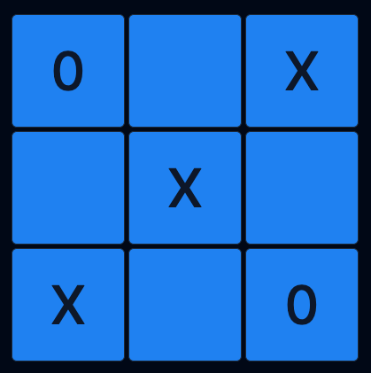
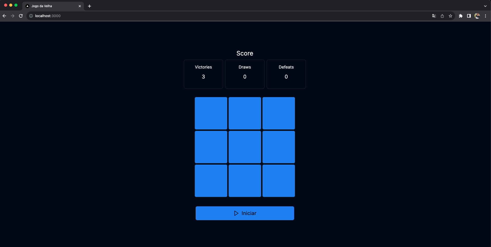
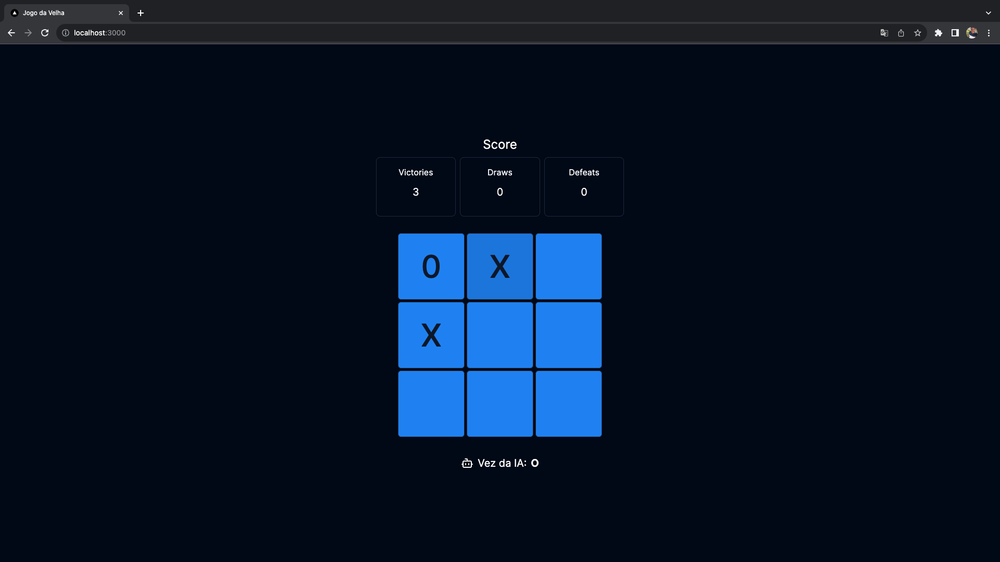
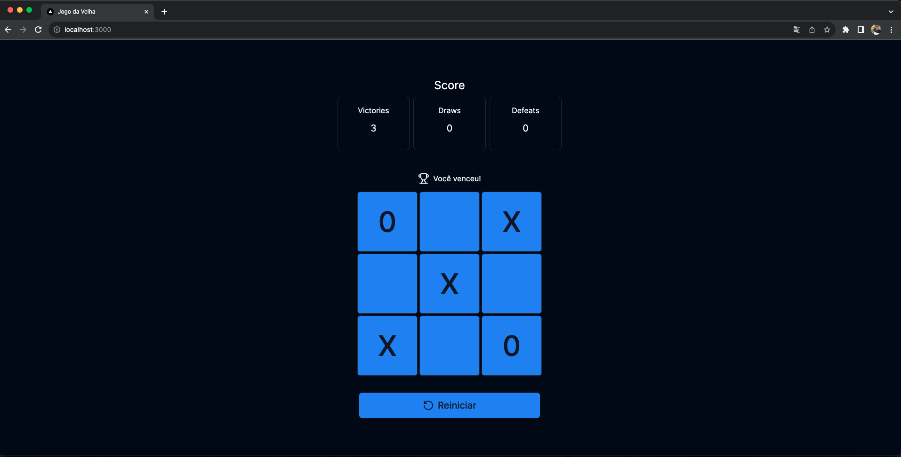

<h1 align="center">
    
    <br/>Jogo Da Velha IA
</h1>

<p align="center">
  
  <a href="https://www.crisnaldocarvalho.com.br">
    
  </a>
  
  
</p>

## Descrição:

Aplicação front-end desenvolvida com NextJS 13, que implementa um jogo da velha, ao qual o usuário joga contra uma inteligência artificial.

Os principais conceitos e regras foram isolados em um pacote core/rules em pequanas funções testáveis, e seus retornos utilizados em lógicas mais complexas. O estado foi compartilhado por contexto, e sua implementação ocorreu por meio de reducer e actions, uma vez que ações do jogo impactam em muitos estados, essa abordagem permite a modificação clara de estados compostos, para facilitar ainda mais essa manipulação foi utilizada a biblioteca immer.

Com as regras e funcionamentos definidos foi inserido uma integração com a OpenAI, para que a partir do quadro do jogo, a IA retornasse o seu passo, garantindo assim a iteratividade do jogo.

## Executando Localmente

Node 18.x

Dentro do diretório execute os comandos abaixo

```bash
pnpm install
```

```bash
pnpm dev
```

Crie seu arquivo .env.local e adicione sua chave de api OPENAI_API_KEY , conforme no .env.example

## Demo

https://github.com/CrisnaldoSantos/jogo-da-velha-ia/assets/45441190/d8c13a42-1997-4d03-af15-0612354064e3

## Screenshots

<p align="center">
    
</p>

<p align="center">
    
</p>

<p align="center">
    
</p>
